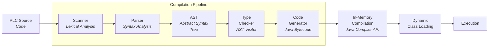

# PLC Compiler — A Programming Language Compiler from Scratch

A complete compiler for the PLC programming language, built entirely in Java. Implements the full compilation pipeline: lexical analysis, parsing, AST construction, type checking, and code generation — with in-memory Java bytecode compilation and dynamic class loading.


## What This Is

A from-scratch compiler that takes PLC source code and compiles it through a multi-stage pipeline into executable Java bytecode. The language supports variables, control flow, binary/unary operations, arrays, image manipulation, and I/O operations.

This isn't a transpiler or interpreter — it generates actual bytecode, compiles it in-memory using the Java Compiler API, and loads the resulting class dynamically for execution.

## Compilation Pipeline



## Technical Highlights

- **Complete Lexer** — Tokenizes source code into keywords, identifiers, numeric/string literals, and operators. Tracks source locations for meaningful error messages with line and column numbers.
- **Recursive Descent Parser** — Builds a full AST supporting: program declarations, statements (assignments, while loops, conditionals), expressions (binary, unary, ternary), function calls, and array access with dimensions.
- **Type Checker** — AST visitor pattern that performs type inference and validates type compatibility across the entire program before code generation.
- **Java Code Generator** — Traverses the typed AST and emits valid Java source code, including symbol table management for variable scoping.
- **In-Memory Bytecode Compilation** — Uses `javax.tools.JavaCompiler` to compile generated Java code directly in memory (no intermediate files), then loads the class via a custom `ClassLoader` for immediate execution.
- **Image Processing** — The language includes built-in support for pixel-level image manipulation with color channel access (RGB), enabling programs that process and transform images.
- **Comprehensive Test Suite** — JUnit 5 tests covering scanner, parser, type checker, and code generator stages independently.

## Language Features

```
// PLC supports:
- Variable declarations with type inference
- Arithmetic and logical expressions
- While loops and conditional statements
- Arrays with dimension support
- Image pixel manipulation (getRed, getGreen, getBlue)
- Console I/O and file I/O
- Random number generation
- String and numeric literals
```

## Architecture

```
src/edu/ufl/cise/plcsp23/
├── Scanner.java              # Lexical analysis — source → tokens
├── Parser.java               # Syntax analysis — tokens → AST
├── ast/                      # AST node definitions
│   ├── AST.java              # Base AST node
│   ├── Program.java          # Root program node
│   ├── Declaration.java      # Variable/function declarations
│   ├── Statement.java        # Assignments, loops, conditionals
│   ├── Expr.java             # Expressions (binary, unary, etc.)
│   └── ...
├── TypeChecker.java          # Type inference & validation (visitor pattern)
├── CodeGenerator.java        # AST → Java source code
├── Token.java                # Token types with source location
└── runtime/
    ├── ConsoleIO.java        # Console I/O support
    ├── FileURLIO.java        # File/URL I/O
    ├── ImageOps.java         # Pixel-level image operations
    └── PixelOps.java         # RGB color channel access

test/edu/ufl/cise/plcsp23/
├── ScannerTest.java
├── ParserTest.java
├── TypeCheckerTest.java
└── CodeGeneratorTest.java
```

## Running

```bash
# Build and run with IntelliJ IDEA or Maven
# Tests
mvn test
# Or run individual test suites
java -cp ... edu.ufl.cise.plcsp23.CodeGeneratorTest
```

## What I Learned

Building a compiler from scratch teaches you things about software that few other projects do — how to design clean intermediate representations, why visitor patterns exist, how type systems actually work, and what it means to turn a grammar into executable code. It's one of the best CS exercises for understanding how the tools we use every day are built.
